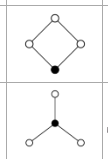

Descartes' Rule of Signs
%
The number $r_+$ of positive real roots of a polynomial $p(x)$ are at most the number $n$ of sign changes in the coefficients.
Moreover, $r$ is *exactly* $n-2k$ for some $k\in \ZZ^{\geq 0}$.
Similarly, the number $r_-$ of negative real roots is the same idea applied to $p(-x)$.

Examples: $x^3 + x^2 - x - 2$ has at most one real root.
%
fact
---

Factor $x^n - a^n$
%
$(x-a)\sum_{k=0}^{n-1} a^k x^{n-k}$
%
formula
---

Factor $x^n + a^n$
%
$(x+a)\sum_{k=0}^{n-1} (-a)_^k x^{n-k}$
%
formula
---

Groups of Order 4
%
$\ZZ/4\ZZ, (\ZZ/2\ZZ)^2$

%
fact
---

Groups of Order 6
%
1 Abelian, 1 Nonabelian
1. $\ZZ/6\ZZ$
2. $D_3$
%
fact
---

Groups of Order 8
%
3 Abelian, 2 Nonabelian
1. $\ZZ/8\ZZ$
2. $\ZZ/4\ZZ \times \ZZ/2\ZZ$
3. $(\ZZ/2\ZZ)^3$
4. $D_4$
5. $Q_8$
%
fact
---

Groups of Order 9
%
1. $\ZZ/9\ZZ$
2. $(\ZZ/3\ZZ)^2$
%
fact
---

Groups of Order 10
%
1 Abelian, 1 Nonabelian
1. $\ZZ/10\ZZ$
2. $D_{5}$
%
fact
---

Groups of Order 12
%
2 Abelian, 3 Nonabelian
1. $\ZZ/4\ZZ \times \ZZ/3\ZZ$
2. $(\ZZ/2\ZZ)^2 \times \ZZ/3\ZZ$
3. $A_4$
4. $D_6$
5. $\gens{a,b,c\suchthat a^2, b^2, c^2, abc}$
%
fact
---

Groups of Order 14
%
1 Abelian, 1 Nonabelian
1. $\ZZ/14\ZZ$
2. $D_7$
%
fact
---

Groups of Order 15
%
$\ZZ/15\ZZ$
%
fact
---

Groups of Order 16
%
5 Abelian, 9 Nonabelian
1. $\ZZ/16\ZZ$
2. $(\ZZ/4\ZZ)^2$
3. $\ZZ/8\ZZ \times \ZZ/2\ZZ$
4. $\ZZ/4\ZZ \times (\ZZ/2\ZZ)^2$
5. $(\ZZ/2\ZZ)^4$

6. $(\ZZ/4\ZZ \cross \ZZ/2\ZZ) \semidirect \ZZ/2\ZZ$
7. $\ZZ/4\ZZ \semidirect \ZZ/4\ZZ$
8. $\ZZ/8\ZZ \semidirect \ZZ/2\ZZ$
9. $D_8$
10. $D_4\cross \ZZ/2\ZZ$
11. $Q_8 \cross \ZZ/2\ZZ$
12. $Q_{16} = \gens{a,b,c \suchthat a^4=b^2=c^2=abc}$
13. $QD_{16} = \gens{r,s\suchthat r^8, s^2, srs\inv s^{-3}}$
14. $(\ZZ/4\ZZ\cross \ZZ/2\ZZ)\semidirect \ZZ/2\ZZ$ (Pauli matrices)
%
fact
---

Groups of Order 18
%
2 Abelian, 2 Nonabelian
1. $\ZZ/18\ZZ$
2. $(\ZZ/3\ZZ)^2\times \ZZ/2\ZZ$
3. $D_9$
4. $S_3 \cross \ZZ/3\ZZ$
%
fact
---

Groups of Order 20
%
2 Abelian, 3 Nonabelian
1. $\ZZ/20\ZZ$
2. $(\ZZ/2\ZZ)^2\times \ZZ/5\ZZ$
3. $D_{10}$
4. $\ZZ/5\ZZ \semidirect \ZZ/4\ZZ$
5. $\gens{a,b,c \suchthat a^5, b^2,c^2}$
%
fact
---

Order of the smallest nonabelian group
%
6: $D_3$
%
fact
---

Simple Group
%
?
%
definition
---

