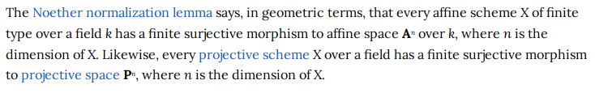

*Reduced* ring
%
A ring $R$ is *reduced* $\iff R$ has no nonzero nilpotent elements, i.e. $x^n  = 0 \implies x=0$.
%
definition
---

Nakayama's Lemma
%
If $M \in \rmod$ is finitely generated and $I\normal R$ with $I \subseteq \mcj(R)$, then $$IM = M \implies M = 0.$$
%
theorem
---

Noether Normalization
%

%
theorem
---

Zariski's Lemma
%
If a field extension is finitely generated as a $k\dash$algebra then it is finite degree.
%
theorem
---

Regular Ring
%
$R$ is regular $\iff R$ is Noetherian and every finitely generated $R\dash$module has a finite resolution by finitely-generated projective $R\dash$modules.
%
algebra, commutative algebra
---

Dedekind Rings
%
Every ideal is projective.
%
commutative algebra
---

Idempotent
%
An element $x$ in a set with a closed binary operation $\cdot$ is *idempotent* iff $x\cdot x = x$.
%
algebra
---

