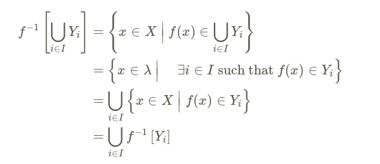

\(f^{-1} \left( \coprod U_i \right) =_? \coprod_i f^{-1} U_i\)?
%
Yes:

%
misc
---

\(f^{-1} \left( \bigcap U_i \right) =_? \bigcap_i f^{-1} U_i\)?
%
Yes
%
misc
---

True or false: \( X =_? (f^{-1} \circ f)(X) \)
%
Only when $f$ is injective, otherwise just \( \subseteq \).
%
misc
---

True or false: \( X =_? (f\circ f^{-1})(X) \)
%
Only when $f$ is surjective, otherwise just \( \subseteq \).
%
misc
---

True or false: \( f^{-1}(A) \setminus f^{-1}(B) =_? f^{-1}(A\setminus B) \)
%
Yes.
For forward direction, only an inclusion.
%
misc
---

True or false: \( \log(a-b) = \log(a) / \log(b) \) 
%
False: take $b=1$, this would force dividing by zero.
%
unsorted
---

True or false: \( \log(a+b) = \log(a) + \log(b) \)
%
False
%
unsorted
---

True or false: \( \log(a+b) = \log(a) \log(b) \) 
%
False
%
unsorted
---

Write \( \log \) as a group homomorphism.
What are the domain and codomain?
%
\[
\log: \GG_m(\RR) \to \GG_a(\RR) 
.\]

%
unsorted
---

Write \( \exp \)  as a group homomorphism.
%
\[
\exp: \GG_a(\RR) \to \GG_m(\RR) 
.\]

%
unsorted
---

What inverses exist for injective (resp. surjective) functions?
%

- Injections: left inverses, i.e. $f(x) = f(y) \implies x=y$
- Surjections: right inverses
%
unsorted
---
