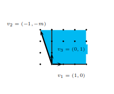
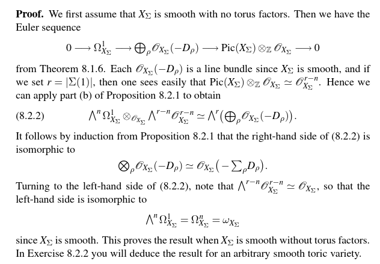

# Orals Basics

Title
%
Content
%
unsorted
---

What is: Affine varieties
%
todo
%
definition
---

    
What is: Projective varieties
%
todo
%
definition
---

    
What is: Morphisms
%
todo
%
definition
---

    
What is: Rational maps
%
todo
%
definition
---

    
What is: Nonsingular varieties
%
todo
%
definition
---

    
What is: Nonsingular curves
%
todo
%
definition
---

    
    
What is: Presheaves
%
todo
%
definition
---

What is: sheafification
%
todo
%
definition
---

What is: morphisms of (pre)sheaves
%
todo
%
definition
---

What is: pullback and pushforward
%
todo
%
definition
---

        
What is: Skyscraper sheaves
%
todo
%
definition
---

What is: constant sheaves
%
todo
%
definition
---

What is: sheaf hom
%
todo
%
definition
---

What is: sheaf kernel/cokernel
%
todo
%
definition
---

        
    
What is: Ringed spaces and their morphisms
%
todo
%
definition
---

What is: the structure sheaf
%
todo
%
definition
---

        
What is: Generic points and closed points
%
todo
%
definition
---

What is: residue fields
%
todo
%
definition
---

        
What is: Definitions of affine/projective/general schemes
%
todo
%
definition
---

What is: Proj
%
todo
%
definition
---

        
What is: Morphisms of finite type
%
todo
%
definition
---

What is: finite morphisms
%
todo
%
definition
---

What is: open/closed immersions
%
todo
%
definition
---

        
What is: Affine and projective morphisms
%
todo
%
definition
---

        
What is: Dimension
%
todo
%
definition
---

What is: Krull dimension
%
todo
%
definition
---

        
What is: Fiber products
%
todo
%
definition
---

        
    
What is: Reduced
%
todo
%
definition
---

What is: irreducible
%
todo
%
definition
---

What is: integral
%
todo
%
definition
---

What is: Noetherian schemes
%
todo
%
definition
---

        
What is: Morphisms of finite type
%
todo
%
definition
---

What is: finite morphisms,
%
todo
%
definition
---

        
What is: Open/closed immersions
%
todo
%
definition
---

What is: dimension
%
todo
%
definition
---

What is: fiber products
%
todo
%
definition
---

        
    
What is: Definition of separated and proper morphisms,
%
We say a variety $X$ is separated if the image of the diagonal map $\Delta: X \rightarrow X \times X$ is Zariski closed in $X \times X$.

For instance, $\mathbb{C}^n$ is separated because the image of the diagonal in $\mathbb{C}^n \times \mathbb{C}^n=$ $\operatorname{Spec}\left(\mathbb{C}\left[x_1, \ldots, x_n, y_1, \ldots, y_n\right]\right)$ is the affine variety $\mathbf{V}\left(x_1-y_1, \ldots, x_n-y_n\right)$. Similarly, any affine variety is separated.

%
definition
---

What is a proper morphism? What are some consequences?
%

Definitions: 

- A morphism of schemes is proper if it is universally closed, separated, of finite type.

- A morphism of algebraic varieties $\phi: X \rightarrow Y$ is proper if it is universally closed, i.e., if for all $\psi: Z \rightarrow Y$, the mapping $\phi^{\prime}: X \times \times_Y Z \rightarrow Z$ is a closed mapping in the Zariski topology.

Important things to note about properness:

(a) $X$ complete iff the structure morphism to a point is proper.
(b) Fibers of a proper morphism are complete.
(c) Inverse images of complete subvarieties of $Y$ are complete.
(d) Any morphism obtained from base change from a proper morphism is automatically proper
%
unsorted
---

When is a toric variety Calabi-Yau?
%
If the fan $\Sigma$ of $X_{\Sigma}$ has all its primitive generators lying on a hyperplane of $N_{\mathbb{R}}$, then $X_{\Sigma}$ is Calabi-Yau.

Proof. Let $D_i$ be all the toric divisors with corresponding primitive generators $u_i$. If all the primitive generators lie on a hyperplane, then we can choose a basis for $N$ such that the first coordinate of each of them is 1 , i.e. $u_{i n}=1$. But then:
\[
0 \sim \operatorname{div}\left(\chi^{e_1}\right)=\left\langle e_1, u_1\right\rangle D_1+\cdots+\left\langle e_1, u_r\right\rangle D_r=\sum D_i .
\]
Hence, since $X_{\Sigma}$ is toric,
\[
\mathcal{K} \cong \mathcal{O}_{X_{\Sigma}}\left(-\sum D_i\right) \cong \mathcal{O}_{X_{\Sigma}},
\]
where $\mathcal{O}_X(D)$ is the sheaf of the Weil divisor $D$. Consequently the canonical divisor is trivial and $X_{\Sigma}$ is Calabi-Yau.

%
unsorted
---

        
What is: Valuative criteria,
%
todo
%
definition
---

        
What is: Projective morphisms,
%
todo
%
definition
---

        
What is: Reduced scheme structure of a closed subset,
%
todo
%
definition
---

        
What is: Scheme-theoretic image,
%
todo
%
definition
---

        
    
What is: Definition of $\mathcal{O}_X$-modules,
%
todo
%
definition
---

        
What is: Quasi-coherent and coherent sheaves,
%
todo
%
definition
---

        
What is: Construction of $\mathcal{O}_X$-modules,
%
todo
%
definition
---

        
    
What is: Invertible sheaves and vector bundles
%
todo
%
definition
---

        
What is: Cartier divisors and their associated invertible sheaves;
%
todo
%
definition
---

        
What is: Multiplicity and support of Cartier divisors;
%
todo
%
definition
---

        
What is: Cartier divisors of rational sections of invertible sheaves;
%
todo
%
definition
---

        
What is: Weil divisors and relation with Cartier (equivalence for locally factorial schemes)
%
todo
%
definition
---

        
What is: The Picard group and class group
%
todo
%
definition
---

        
What is: Degree of a divisor
%
todo
%
definition
---

        
    
What is: Ample and very ample sheaves,
%
todo
%
definition
---

        
What is: Blowups
%
todo
%
definition
---

        
    
What is: Derivations
%
todo
%
definition
---

What is: module of relative differential forms
%
todo
%
definition
---

        
What is: Tangent sheaf
%
todo
%
definition
---

        
What is: Algebraic differential forms;
%
todo
%
definition
---

        
What is: Dualizing sheaf and Serre duality
%
todo
%
definition
---

What is: relation to the canonical sheaf
%
todo
%
definition
---

        
What is: The (co)normal sheaf,
%
todo
%
definition
---

        
What is: Regular immersions and local complete intersections;
%
todo
%
definition
---

    
What is: Normal schemes and normalization
%
A ring $R$ with field of fractions $K$ is **normal** if every element of $K$ which is integral over $R$ (i.e. a root of monic polynomial in $R[x]$ ) is actually in $R$. 

A variety $X$ is **normal** if it is irreducible and the local rings $\mathcal{O}_{X, p}$ are normal for all $p \in X$.

%
definition
---

    
What is: Blowups
%
todo
%
definition
---

What is: the adjunction formula
%
todo
%
definition
---

What is: crepant resolutions
%
todo
%
definition
---

    
What is: Geometric and arithmetic genus
%
todo
%
definition
---

    
What is: Riemann-Roch
%
todo
%
definition
---

    
What is: Riemann-Hurwitz
%
todo
%
definition
---

    
What is: The dual character/cocharacter lattices M and N,
%
todo
%
definition
---

        
What is: Strongly convex rational polyhedral cones and their dual cones
%
todo
%
definition
---

        
What is: Constructing affine toric varieties from semigroup algebras
%
todo
%
definition
---

What is: and projective toric varieties from gluing affines
%
todo
%
definition
---

        
What is: Toric varieties from polytopes
%
todo
%
definition
---

What is: polar duals
%
todo
%
definition
---

What is: reflexive polytopes
%
todo
%
definition
---

        
What is: The orbit-cone correspondence
%
todo
%
definition
---

What is: orbit closures
%
todo
%
definition
---

        
What is: Toric morphisms
%
todo
%
definition
---

    
What is: Checking smoothness
%

Let $\sigma \subseteq N_{\mathbb{R}}$ be a scrapc,

- $\sigma$ is **smooth** if its minimal generators form part of a $\mathbb{Z}$-basis for $N$.
- $\sigma$ is **simplicial** if its minimal generators are linearly independent over $N_{\mathbb{R}}$.

%
definition
---

Give an example of a simplicial cone that is not smooth.
%

%
examples
---

What is: properness/completeness
%
todo
%
definition
---

        
What is: Sufficient conditions for orbifold/quotient singularities
%
todo
%
definition
---

        
What is: Characterization of (very) ample line bundles
%
todo
%
definition
---

        
What is: Sections of line bundles from lattice points of rational convex polyhedra
%
todo
%
definition
---

        
What is: Classification of complete nonsingular toric surfaces
%
todo
%
definition
---

        
What is: Classification of smooth del Pezzo surfaces
%
todo
%
definition
---

        
What is: Blowups and resolution of singularities
%
todo
%
definition
---

        
What is: Weil divisors associated to rays
%
todo
%
definition
---

        
What is: Cartier divisors associated to integral piecewise-linear support functions
%
todo
%
definition
---

        
What is: Global sections of line bundles
%
todo
%
definition
---

        
What is: Canonical divisors of toric varieties
%
todo
%
definition
---

What is: Fano toric varieties
%
todo
%
definition
---

        
    
What is: Fundamental groups and Euler characteristics,
%
todo
%
definition
---

        
What is: T-Cartier and T-Weil divisors and their intersection numbers
%
todo
%
definition
---

        
What is: $\mathrm{Pic}(X)$ and the divisor class group
%
todo
%
definition
---

What is $\sigma\dual$?
%

The dual of a cone $\sigma$ is
\[
\sigma^{\vee}:=\left\{u \in M_{\mathbb{R}}:\langle u, v\rangle \geq 0 \forall v \in \sigma\right\}
\]

%
unsorted
---

What is the canonical sheaf of a toric variety?
%
Theorem 8.2.3. For a toric variety $X_{\Sigma}$, the canonical sheaf $\omega_{X_{\Sigma}}$ is given by
\[
\omega_{X_{\Sigma}} \simeq \mathscr{O}_{X_{\Sigma}}\left(-\sum_\rho D_\rho\right) .
\]
Thus $K_{X_{\Sigma}}=-\sum_\rho D_\rho$ is a torus-invariant canonical divisor on $X_{\Sigma}$.

Proof:

%
unsorted
---
