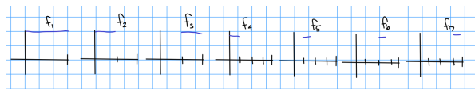
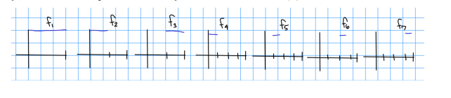

Fatou's Lemma
%
If $\theset{f_n} \subset L^+$, then $$\int \liminf f_n \leq \liminf \int f_n$$
%
theorem
---

Egorov's Theorem
%
If $E\subset \RR^n$ is measurable, $m(E) > 0$, and $\theset{f_n}$ measurable with $f_k \to f$ with $f(x) < \infty$ existing and finite a.e., then $f_n\to f$ *almost uniformly*, i.e.
for all $\eps > 0$ there exists a closed $F\subset E$ such that $m(E\setminus F)<\eps$ and $f\converges{u}\to f$ on $F$.
%
theorem
---

Riesz Representation Theorem
%
For $1\leq p <\infty$, $X \subset \RR^n$ measurable, $\Lambda \in L^p(X)\dual$, there exists a unique $g\in L^q(X)$ such that for all $f\in L^p(X)$, $\Lambda(f) = \int_X fg$ and $\norm{\Lambda}_{L^p(X)\dual} = \norm{g}_{L^q(X)}$.
%
theorem
---

Borel set
%
The smallest $\sigma\dash$algebra generated by the topology, i.e. every element is obtained by countable unions/intersections/complements of open sets.
%
definition
---

Dominated Convergence Theorem
%
If $\theset{f_n} \subset L^1$ and $f_n\to f$ a.e. with $\abs{f_n} \leq g \in L^1$ for every $n$, then
$$\lim \int f_n = \int \lim f_n$$
%
theorem
---

Monotone Convergence Theorem
If $f_n \in L^+$ and $f_n\nearrow f$ a.e. then
$$
\lim \int f_n = \int \lim f_n
$$
%
theorem
---

(Lebesgue) Measurable Function 
%
?
%
definition
---

Equivalent Characterizations of Completeness
%

- Every Cauchy sequence converges
- Every absolutely convergent series converges
%
definition
---

Bernoulli's Inequality
%
$(1+x)^n \geq 1 + nx$ for all $n\in \RR$ and $x\geq -1$. If $n\in 2\ZZ$, then this is valid for all $x\in \RR$. Prove by induction.
%
formula
---

Uniform Continuity
%
For $f: (X, d_1) \to (Y, d_2)$, for every $\eps > 0$ there exists $\delta(\eps) > 0$ such that for every $x,y\in X$, $x\in B_\delta(y) \implies f(x) \in B_\eps(f(y))$.
%
definition
---

Proof of Borel-Cantelli Lemma
%
*Proof of Borel Cantelli:*
 
- If $E = \limsup_j E_j$ with $\sum m(E_j) < \infty$ then $m(E) = 0$.
- If $E_j$ are measurable, then $\limsup_j E_j$ is measurable.
- If $\sum_j m(E_j) < \infty$, then $\sum_{j=N}^\infty m(E_j) \converges{N\to\infty}\to 0$ as the tail of a convergent sequence.
- $E = \limsup_j E_j = \intersect_{k=1}^\infty \union_{j=k}^\infty E_j \implies E \subseteq \union_{j=k}^\infty$ for all $k$
- $E \subset \union_{j=k}^\infty \implies m(E) \leq \sum_{j=k}^\infty m(E_j) \converges{k\to\infty}\to 0$.
%
proof
---

Baire Space
%
Countable intersections of open dense sets are still dense
%
definition
---

Limsup/Liminf of Sets
%
\begin{align*}
\limsup_n A_n \definedas \intersect_n \union_{j\geq n} A_j&= \theset{x \suchthat x\in A_n \text{ for inf. many $n$}}  \\
\liminf_n A_n \definedas \union_n \intersect_{j\geq n} A_j &= \theset{x \suchthat x\in A_n \text{ for all except fin. many $n$}}  \\
.\end{align*}
%
definition
---

Arzela-Ascoli Theorem
%
A sequence of functions $\theset{f_n}$ has a uniformly convergent subsequence $\iff \theset{f_n}$ is uniformly bounded and uniformly equicontinuous.
%
theorem
---

Cauchy-Schwarz Inequality
%
$$\abs{\inner{f}{g}} \definedas \norm{fg_1} \leq \norm{f}_2 \norm{g}_2$$ with equality iff $f \in \spanof_\CC(g)$.
%
formula
---

Minkowski's Inequality
%
For $1 \leq p < \infty$, $$\norm{f + g}_p \leq \norm{f}_p + \norm{g}_p.$$
%

---

Holder's Inequality
%
$\norm{fg}_1 \leq \norm{f}_p \norm{f}_q$
%
formula
---

Young's Inequality
%
For $1\leq p, q\leq r \leq \infty$ with ${1\over p} + {1\over q} - {1\over r} = 1$, then $\norm{f\ast g}_r \leq \norm{f}_p \norm{g}_q$.
Useful cases:
\begin{align*}
\norm{f\ast g}_1 & \leq \norm{f}_1 \norm{g}_1 \\
\norm{f\ast g}_p & \leq \norm{f}_1 \norm{g}_p \\
\norm{f\ast g}_\infty & \leq \norm{f}_p \norm{g}_q \\
\norm{f\ast g}_\infty & \leq \norm{f}_2 \norm{g}_2 
.\end{align*}

%
formula
---

Baire Space
%
$X$ is a Baire space iff whenever $\theset{U_n}$ is a collection of open dense subsets of $X$, then their intersection $\intersect U_n$ is again dense.
%
definition
---

First and Second Category
%

- A subset is *first category* iff it is countable union of nowhere dense sets.
- A subset is *second category* otherwise.
%
definition
---

Nowhere Dense
%
A set is $A$ **nowhere dense** if its closure has empty interior $\qty{\bar A}^\circ$, equivalently it is not dense in *any* nonempty open set.
For $\RR$, every interval $I$ contains a subinterval $S\subset I$ with $S\intersect A = \emptyset$, i.e. its closure contains no intervals.

Intuition: elements are not tightly clustered, set is full of holes.

Counterexample: $\theset{1 \over n}, \ZZ$ are nowhere dense, $\QQ, \ZZ\union \qty{(a, b)\intersect \QQ}$ is *not* nowhere dense
%
definition, example, counterexample
---

Equicontinuous
%
For $X, Y$ metric spaces and $\mcf$ a family of functions, $F$ is *equicontinuous at $x_0$* iff for every $\eps > 0$ there exists a $\delta(\eps, x_0)>0$ such that $x\in B_\delta(x_0) \implies f_i(x) \in B_\eps(f_i(x_0))$ for all $f_i \in \mcf$.
The family $F$ is *uniformly equicontinuous* iff $\delta(\eps)$ only depends on $\eps$ and holds for any pair $x_1, x_2$ with $x_1 \in B_\delta(x_2)$.
%
definition
---

Convolution
%
$$(f\ast g)(\xi) = \int f(\xi - y)g(y) ~dy$$
%
formula
---

Reverse Triangle Inequality
%
$\abs{\norm x - \norm y} \leq \norm{x-y}$
%
formula
---

Bessel's Inequality
%
For $x\in H$ a Hilbert spaces and $\theset{e_k}$ an orthonormal sequence, $$\sum \abs{\inner{x}{e_k}}^2 \leq \norm{x}^2$$
%
formula
---

Parseval's Identity
%
Equality in Bessel's inequality, obtained when $\theset{e_k}$ is a basis.
%
theorem
---

Riemann-Lebesgue Lemma
%
If $f\in L^1$, then the Fourier transform $\hat f(\xi) \converges{\abs{\xi}\to \infty}\to 0$.
%
theorem
---

$G_\delta$ sets
%
$X$ is $G_\delta$ iff $X$ is a countable intersection of open sets.
%
definition
---

$F_\sigma$ sets
%
$X$ is $F_\sigma$ iff $X$ is a countable union of closed sets.
%
definition
---

Meagre Set
%
A set is *meagre* iff it is a countable union of nowhere dense sets.
%
definition
---

Null Set
%
A set $A$ is *null* iff for every $\eps>0$ there exists a cover $\theset{U_j}\covers A$ such that $\sum \mu(U_j) < \eps$, i.e. $\mu(A) = 0$.
%
definition
---

Characterizations of $D_f$, the set of discontinuities of functions
%

- Always $F_\sigma$, closed, positive oscillation.
- $f_n\to f$ with $f_n$ continuous $\implies D_f$ is meager.
- (Lebesgue criterion) $f \in \mathcal{R}(a, b)$ and bounded $\implies D_f$ is null.
- $f$ monotone $\implies D_f$ is countable, and additionally $f$ differentiable on $(a, b) \implies D_f$ is null.

%
fact
---

Showing uniform convergence of a *sequence* of functions
%
Find $M_n$ independent of $x$ such that $\abs{f_n(x) - f(x)} \leq M_n \to 0$.
%
technique
---

Showing uniform convergence of a *series* of functions
%
$M\dash$test: find $M_n$ independent of $x$ such that $\norm{f_n}_\infty < M_n$ where $\sum M_n < \infty$
%
technique
---

Uniform Convergence of a sequence of functions
%
$\theset{f_n} \converges{u}\to f$ on $E$ iff for every $\eps>0$ that exists an $N(\eps)$ such that for all $n\geq N$ and for all $x\in E$, $\abs{f_n(x) - f(x)} < \eps$.
Equivalently, $\norm{f_n - f}_\infty \definedas \sup_{x\in E}\abs{f_n(x) - f(x)} < \eps$.
%
definition
---

Example of a function that converges pointwise but not uniformly
%
$f_n(x) \definedas x^n$.
%
counterexample
---

Negating uniform convergence of a sequence of functions
%
Fix $\eps$, find $x(\eps, n)$ with $\abs{f_n(x) - f(x)} > > \eps$.
Example: ${1 \over 1 + nx}$.
%
technique
---

Baire Category Theorem
%
If $X$ is a complete metric space or a locally compact Hausdorff space, then $X$ is a Baire space.
A (non-empty) complete metric space is *not* the countable union of nowhere dense sets.
%
theorem
---

Relationship between continuity and differentiability
%
Differentiability $\implies$ continuity: 
\begin{align*}
f(x) - f(x_0) = (x-x_0) \qty{ f(x)-f(x_0) \over x-x_0 } \to 0
.\end{align*}
Not conversely: $f(x) = \abs{x}$.
%
proof
---

Continuity of measure from above/below 
%
- Below: $E_i \nearrow E \implies \mu(E_i) \to \mu(E)$.
- Above: $E_i\searrow E, ~\mu(E_1) < \infty \implies \mu(E_i) \to \mu(E)$.
%
theorem
---

Caratheodory Characterization
%
$E\subseteq \RR^n$ is measurable $\iff$ for all $A\subset \RR^n$, $m_*(A) = m_*(E\intersect A) + m_*(E\intersect A^c)$.
%
theorem
---

Equivalent characterizations of measurability of a set
%
$E\subset \RR^n$ is measurable iff any of these conditions hold

- There exist closed $F\subseteq E$ with $m_*(E\setminus F) < \eps \to 0$.
- There exist *compact* $K\subseteq E$ with $m_*(E\setminus K) < \eps \to 0$.
- There exist open $G\supset E$ with $m_*(G\setminus E)<\eps \to 0$ (outer regular)
- $E = H \union Z$ with $H\in F_\sigma$ and $Z$ null
- $E = V\setminus Z$ with $V\in G_\delta$ and $Z$ null
%
theorem
---

Definition: Measurability of a Set
%
A set $E\subseteq \RR^n$ is *measurable* iff for every $\eps>0$ there exists an open $G(\eps) \supset E$ with $m_*(G(\eps)\setminus E)<\eps \to 0$ (outer regular).
%
definition
---

Sets known to be measurable
%

- Open
- Closed
- Outer measure zero
- $M\cross \RR$ for $M$ measurable (a cylinder)
%

---

Example of a function that is Lebesgue integrable but not Riemann integrable

%
The Dirichlet function $f(x) = \chi_\QQ$, since $D_f = \RR$ is not null.
%
counterexample
---

Definition of Outer Measure
%
$m_*(E) = \inf \theset{ \sum \abs{Q_i} \suchthat \theset{Q_i}\covers E \text { closed cubes}}$.
%
definition
---

Definition: Almost Disjoint
%
$A^\circ \intersect B^\circ = \emptyset$
%
definition
---

Definition: Measurable Function
%
$f:\RR \to \bar \RR$ is Lebesgue/Borel measurable iff
\begin{align*}
\left.\{x \in E | f(x)>a\}=f^{-1}((a, \infty])\right) \in \mathcal{M}_L, \mathcal{M}_B
,\end{align*}
the collection of Lebesgue/Borel measurable *sets* respectively.
%
definition
---

Lusin's Theorem
%
If $f$ is measurable and finite-valued on a measurable $E$ with $m(E) < \infty$ then there exist closed sets $F\subset E$ such that $m(E\setminus F) < \eps \to 0$ such that $f\mid_F$ is continuous.
%
theorem
---

Convergence in Measure
%
\begin{align*}
\lim _{k \rightarrow \infty} m\left(\left\{x \in E|| f_{k}(x)-f(x) |>\alpha\right\}\right)=0
.\end{align*}
%
definition
---

Proposition: Convergence in measure is equivalent to a.e. convergence
%
Proof: ? Use Egorov's Theorem
%
proof
---

Definition: The Lebesgue Integral
%
\begin{align*}
\int f:=\sup \left\{\int \phi | 0 \leq \phi \leq f, \phi \text { simple }\right\}
.\end{align*}
%
definition
---

Chebyshev's Inequality
%
\begin{align*}
\mu\qty{\{x | f(x) \geq \alpha\}} \geq \frac{1}{\alpha} \int f \quad \forall \alpha
.\end{align*}
%
definition
---

Proposition: $\int f = 0 \implies \int f = 0$ a.e.
%
Proof: ?
%
proof
---

How to commute a sum and an integral
%
$f_n \in L^1$ with $\sum \int \abs{f_n} < \infty$.
%
technique
---

Proposition: $\sum \abs{f_n} \in L^1 \implies \sum \abs{f_n(x)} < \infty$ a.e.
%
Proof: ?
%
proof
---

A sequence of functions that converges uniformly, pointwise, a.e., but not in $L^1$.
%
$$f_n \definedas {1\over n} \chi_{[0, n]}$$
%
counterexamples
---

Relative strengths of convergence
%
Uniform $\implies$ pointwise $\implies$ a.e., convergence in norm is incomparable (but generally weaker)
%
fact
---

A sequence of functions that converges pointwise and a.e. but not uniformly or in $L^1$.
%
$$f_n \definedas \chi_{(n, n+1)}$$
%
counterexamples
---

A sequence of functions that a.e. but not in $L^1$, uniformly, or pointwise 
%
$$f_n \definedas n \chi_{(0, {1\over n} )}$$
%
counterexamples
---

A sequence of functions that converges in $L^1$ but not uniformly, pointwise, or a.e. 
%

%
counterexamples
---

Small Tails and Absolute Continuity
%
Let $f\in L^1$ and $\eps> 0$.

1. Small Tails: there exists an $N$ such that $\int_{B_N^c} f < \eps$
2. Absolute Continuity: there exists a $\delta$ such that $m(E) < \delta \implies \int_E \abs{f} < \eps$.
%
theorem
---

Continuity in $L^1$
%
\begin{align*}
f \in L^{1} \Longrightarrow \lim _{h \rightarrow 0} \int|f(x+h)-f(x)|=0
.\end{align*}
%
theorem
---

Proposition: Continuity in $L^1$
%
Proof: ?
%
proof
---

Proposition: Translation/Dilation Invariance of the Lebesgue Integral
%
Proof: ?
%
proof
---

Tonelli
%
For $f(x, y)$ non-negative and measurable on $\RR^{n+m}$,

1. $f_x(y) \definedas f(x, y)$ is measurable for a.e. $x$
2. $F(x) \definedas \int f(x, y) \, dy$ is measurable
3. $G(y)\definedas \iint f(x, y) \, dxdy$ is measurable and equals $\int f$

Moral: non-negative and measurable allows switching order of integrals.

%
theorem
---

Fubini
%
Let $f$ be measurable.
Then for almost every $x$,

1. $f_x(y)\definedas f(x ,y)$ is *integrable*.
2. $F(x) \definedas \int f(x, y) \, dxdy$ is *integrable*
3. $\int f = \iint f(x, y) \, dxdy$ in any order.
%
theorem
---

Fubini-Tonelli
%
If $f$ is measurable and any iterated integral $\iint \abs{f} < \infty$, then Tonelli on $\abs{f}$ yields $f\in L^1$ and $\int f$ is equal to any iterated integral.
%
theorem
---

Definition: separable
%
Has a countable dense subset
%
definition
---

Give an example of a sequence of functions that converge uniformly but not in $L^1$.
%
The box of height $1\over n$ and width $n$ uniformly converges to zero but integrates to 1.
%
example
---

Give an example of a sequence of functions that converge pointwise but not uniformly or in $L^1$.
%
Skateboard to infinity: $\chi_{[n, n+1]}$.
%
example
---

Give an example of a function that converge almost everywhere but not pointwise or in $L^1$.
%
$f_n = n\chi_{(0, {1\over n})}$
%
example
---

Give an example of a function that converges in $L^1$ but not pointwise.
%
The Cathode Ray:

%
example
---

