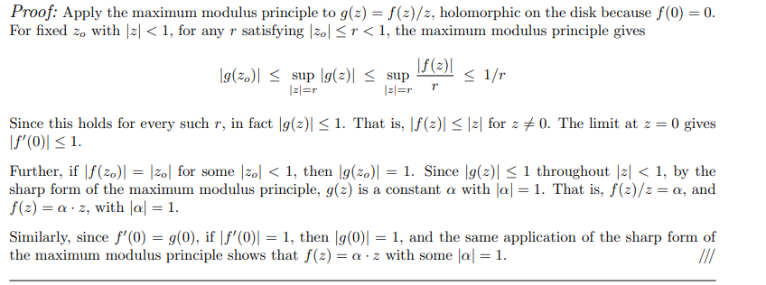

Liouville's Theorem
%
?
%
definition
---

The maximum modulus principal
%
?
%
definition
---

The fundamental theorem of algebra
%
?
%
definition
---

Rouché's theorem
%
?
%
definition
---

The Schwarz lemma
%
In parts:

- $f(z) = \sum_{k\geq 1}c_k z^k$ since $f(0) = 0$ implies $c_0 = 0$.
- $g(z) \da f(z)/z = \sum_{k\geq 1}c_k z^{k-1}$ and $g(0) = c_1 = f'(0)$.
- $\abs{f}\leq 1\implies \abs{g} \leq r\inv$ on $\abs{z} = r$, thus on $\abs{z} \leq r$ by MMP.
- Take the limit $r\to 1$.
- Part 2: extremum in interior implies $g(z) \equiv c$ is constant.
- $\abs{f'(0)} = 1$ or $f(z) = z$ for some $z\neq 0$ implies $\abs{c} = 1$.

%
definition
---

Open mapping theorem
%
?
%
definition
---

Casorati-Weierstrass
%
?
%
definition
---

The Riemann mapping theorem
%
?
%
definition
---
