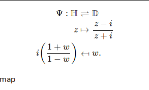
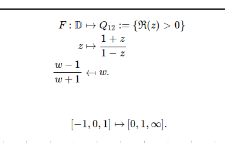
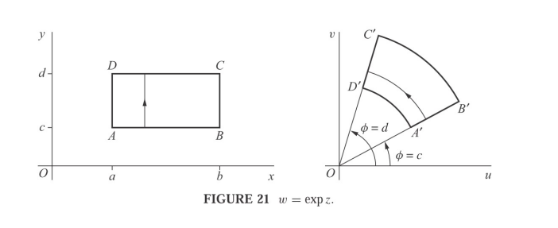
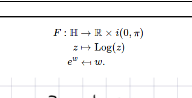

Conformal map: $\HH\to \DD$
%

%
definition
---

Conformal map: right-half-plane to $\DD$
%

%
definition
---

Conformal map: image of a region under the exponential map
%

%
definition
---

Strip to half-plane
%

%
definition
---
