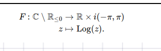
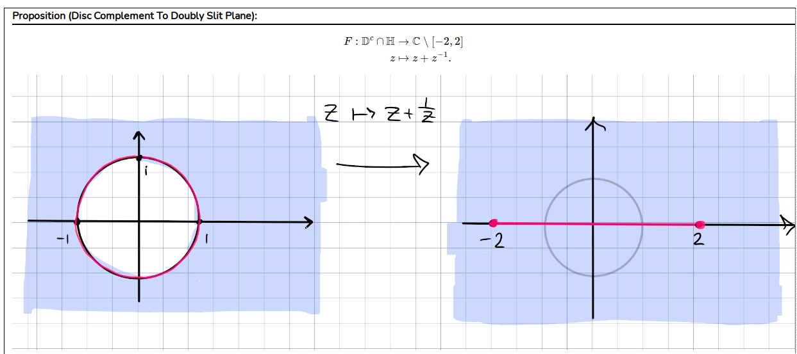
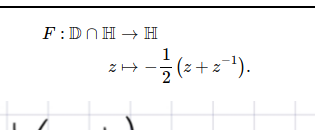

Conformal map: $\HH\to \DD$
%

%
definition
---

Conformal map: right-half-plane to $\DD$
%

%
definition
---

Conformal map: image of a region under the exponential map
%

%
definition
---

Conformal map: strip to half-plane
%

%
definition
---

Conformal map: $\HH \sm (-\infty ,0]$ to a horizontal strip
%

%
definition
---

Conformal map: what does $z+a\inv$ do?
%

%
definition
---

Conformal map: upper half-disc to $\HH$
%

%
definition
---
