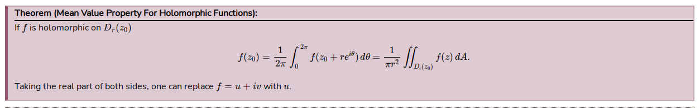
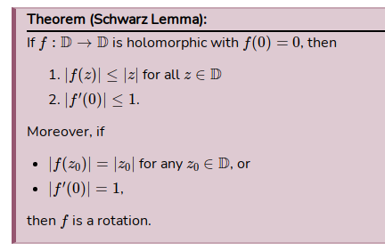

Dirichlet's Test
%
If \(\theset{a_n}, \theset{b_n}\) satisfy

- \(  a_n \searrow 0\) 
- For every $N$, there exists an \(M_N\) such that \(  \abs{\sum_{n=1}^N b_n} \leq M_N\)

Then \[ \sum_{n=1}^\infty a_n b_n < \infty .\]
%
theorem
---

Morera's Theorem
%
If $f$ is continuous in an open disc $\DD$ and 
\[  
\text{For all triangles } T\subset \DD, \qquad \int_T f = 0
,\]
then $f$ is holomorphic.
%
theorem
---

Riemann's Removable Singularity Theorem
%
Let $U\subset \CC$ be open, $a\in U$, and $f$ holomorphic on $U\setminus\theset{a}$. 
Then TFAE

- $f$ extends holomorphically to all of $U$
- $f$ extends continuously to all of $U$
- There exists a neighborhood of $a$ on which $f$ is bounded.
- The limit characterization:
\[
\lim_{z\to a} (z-a)f(z) = 0
.\]
%
theorem
---

Casorati-Weierstrass Theorem
%
- If $f$ is holomorphic on \(\Omega\setminus\theset{z_0} \subseteq \CC\) where \(z_0\) is an essential singularity and \(V\subseteq \Omega\) then \(f(V\setminus\theset{z_0}) \injects \CC\) is dense.
- If $f$ is non-constant and entire then \(f(\CC)\injects \CP^1\) is dense.
%
Theorem
---

Maximum Modulus Principle
%
If $f: \Omega \to \CC$ is holomorphic and not constant on $\Omega$, then $\abs{f}$ is unbounded in $\Omega^\circ$.
%
complex, theorem
---

Open Mapping Theorem
%
If $f: \Omega \to \CC$ is holomorphic and not constant on $\Omega$, then $f$ is an open map.
%
complex, theorem
---

Exponential expansions of $\sin(z)$
%
\[\begin{align*}
\sin(\theta) &= \frac{e^{i\theta} - e^{-i\theta}}{2i} = \frac{z - z\inv}{2i} \\
d\theta &= \frac{dz}{iz}
\end{align*}\]
%
complex, identity
---

Cauchy-Goursat Theorem
%
If $f$ is holomorphic on a simply connected region $\Omega$ containing a contour $\gamma$, then \[\int_\gamma f = 0.\]
Moreover, this holds for any contour $\gamma \subset \Omega$.
%
complex, theorem
---

Types of isolated singularities
%

- Removable: $\abs{f(z)}$ is bounded in a punctured disc.
- Poles: $\lim_{z\to p} \abs{f(z)} = \infty$.
- Essential: neither removable nor a pole.
%

complex, fact
---

Mean value theorem for holomorphic and harmonic functions
%

%
definition
---

Schwarz Lemma
%

%
definition
---
