# Instructions

- You'll need a working installation of [Python 3](https://realpython.com/installing-python/)
- (Optional) Install [ankdown](https://github.com/benwr/ankdown). If you have pip, you can just run something like `pip3 install --user ankdown`.
  - Alternative: I've included my own modified copy of `ankdown.py` that can just be run directly by either
    - Running `chmod +x ankdown.py` and subsequently `ankdown.py ...`
    - Running `python3 ./ankdown.py ...`
- As a test, you can try running  `ankdown ./ankdown.py -r ./Decks -p ./mathnotes.apkg`
  - The '-r' option points it at a directory, which is recursively searches for '.md' files to parse as cards
  - The '-p' option tells it to output a '.apkg' file, which can be imported to Anki
- This should generate 'mathnotes.apkg', which you can import into Anki directly:

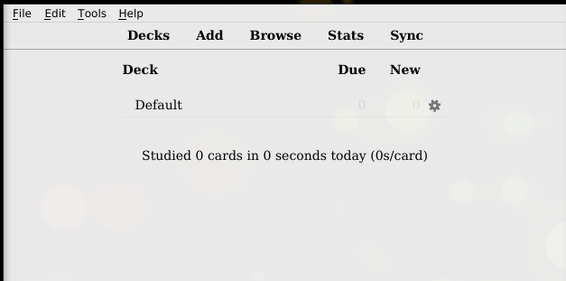


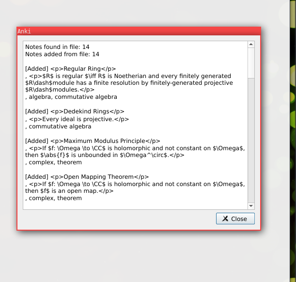

- If you now click "Browse" and "Whole Collection" (or the specific new deck) from the left-side panel, you should see a list of cards:

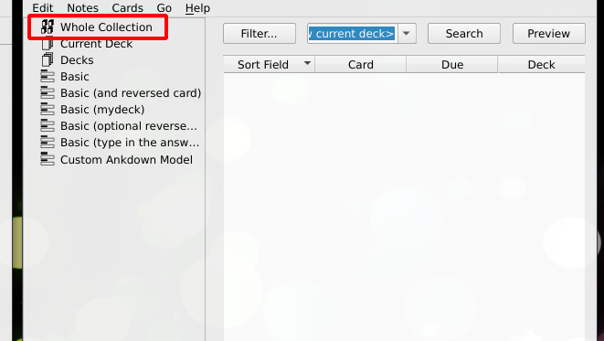

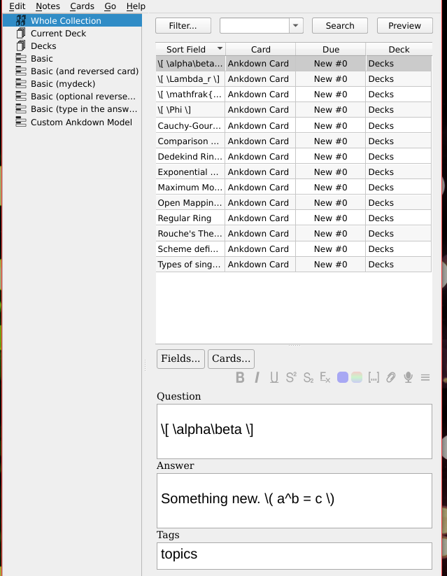

- If you click a card from the list and click "Cards", you should be able to preview the card being rendered in Mathjax:

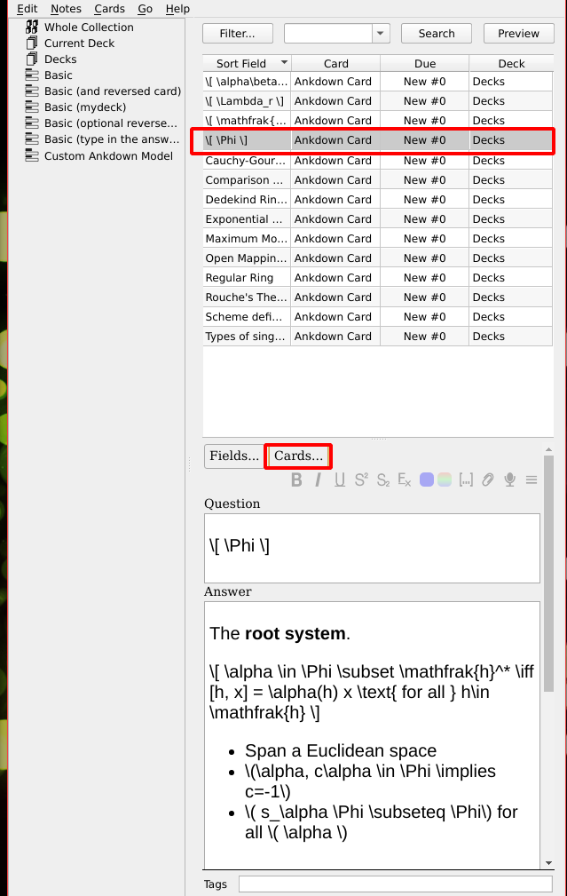

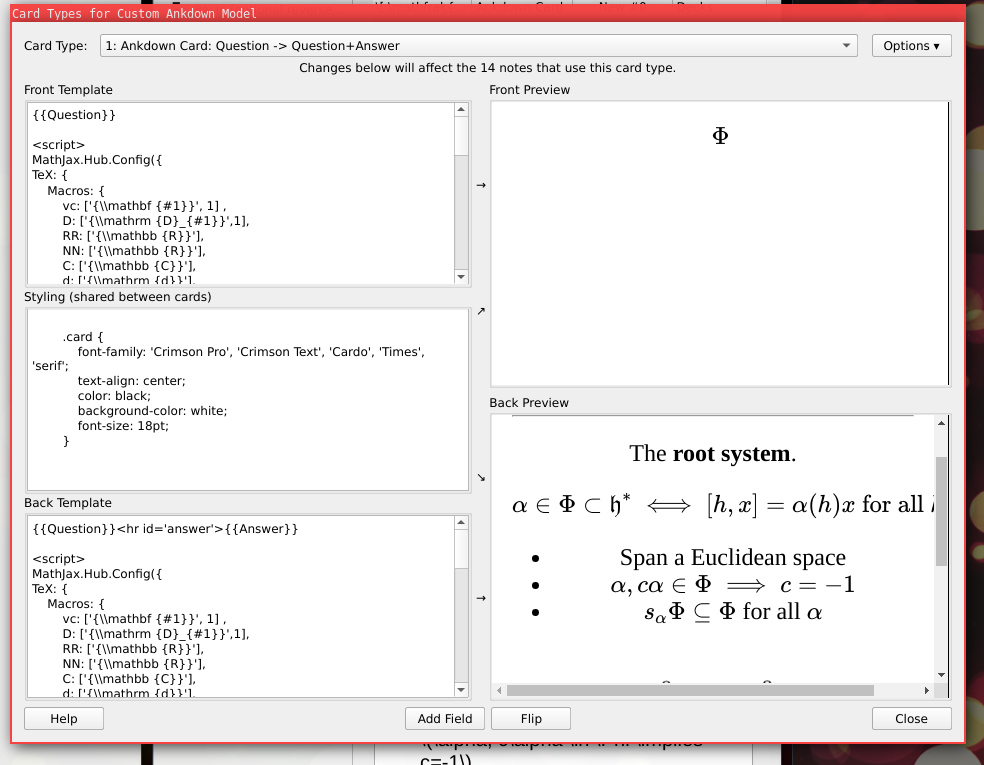

- To begin studying, from the main screen, just click the deck and "Study Now":

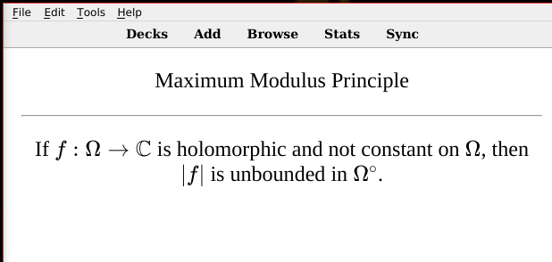


# Notes

- The general template for new cards is
```
Question Field, with inline math $ax+b$ and/or displaymath $$\int_D f(z)$$
%
Answer Field, with inline math $cx+d$ and/or displaymath $$\sum_{i=1}^N c_n$$
%
tag1, tag2
```

- See the files under 'Decks' for examples of how to typeset things. Generally basic inline math like `$ax+b$` and display style equations like `$$\int_0^1 f(x)$$` tend to work fine.
  - You can use markdown in your cards, including lists. I haven't tested images yet. See [here](https://github.com/adam-p/markdown-here/wiki/Markdown-Cheatsheet) for general markdown syntax.

- Everything is rendered with Mathjax, which has only a small subset of Latex functionality.
  One nice way to edit cards is to use something like [HackMD](http://hackmd.io) where you can preview the output of all of the cards before actually "compiling" it into Anki deck:
  
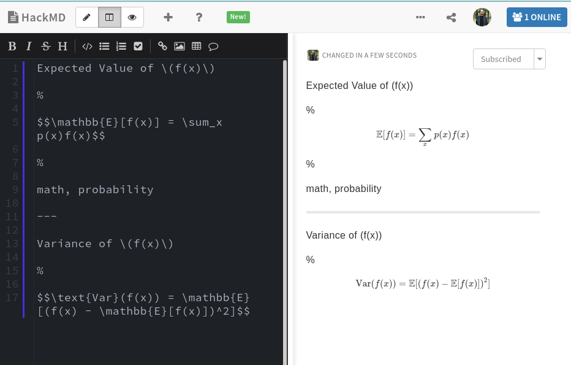

- You can add Mathjax macros directly to the card template within Anki, but it's better to modify 'ankdown.py' so that your macros are included whenever a new deck is generated.


## Automating

- Install the [ankdown Anki plugin](https://ankiweb.net/shared/info/109255569) (Tools->Addons->Get Add-ons, then enter the add-on code)

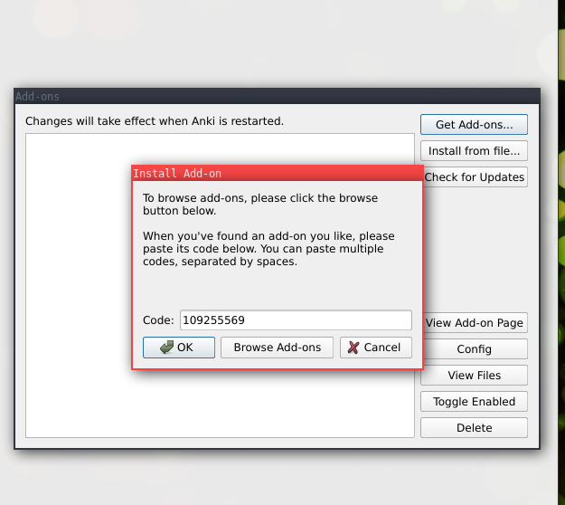

- Restart Anki, navigate back to the Ankdown add-on and click "Config"
  - Change the file path for "Ankdown Location" to wherever your installed version is, or the version in this repository.
  - Change the file path for "Markdown Deck Library Path" to the "Decks" path in this repository, or wherever you'd like to store yours.
  - For example,
```
{
    "Ankdown Location": "/home/zack/SparkleShare/github.com/Math-Flashcards/ankdown.py",
    "Markdown Deck Library Path": "/home/zack/SparkleShare/github.com/Math-Flashcards/Decks"
}
```

- Now pressing F5 or selecting "Tools->Reload Markdown Decks" will automatically re-scan your directory and add any new cards it finds. Cool!
  - Note: it's hard to tell if/when this works. My modified ankdown script will attempt to send a push notification to your OS when it updates decks:

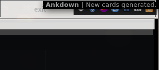

- To test, just modify any of the files under "Decks", add a new entry, press F5 in Anki, then browse the Deck to see if it appears:

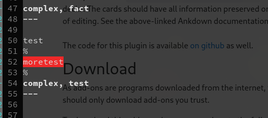

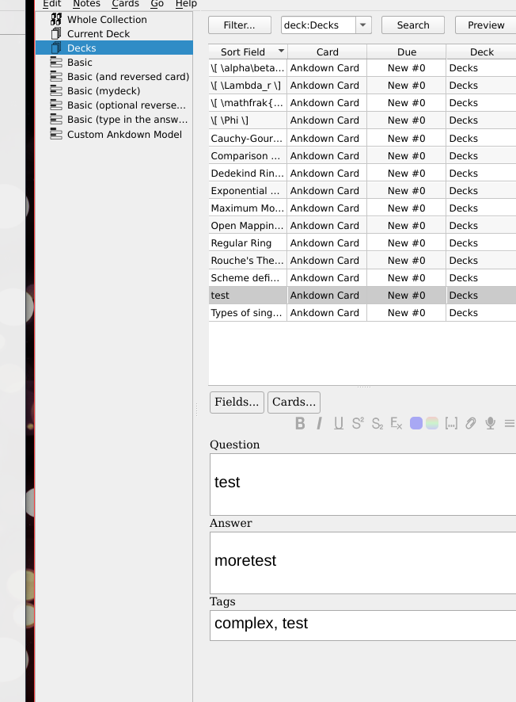

- It's also helpful to create an Ankiweb account and enable syncing -- then you can review your cards on the phone app:

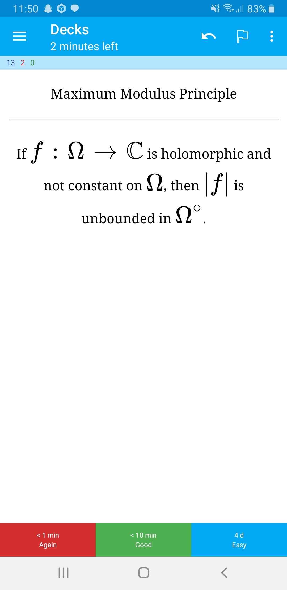
